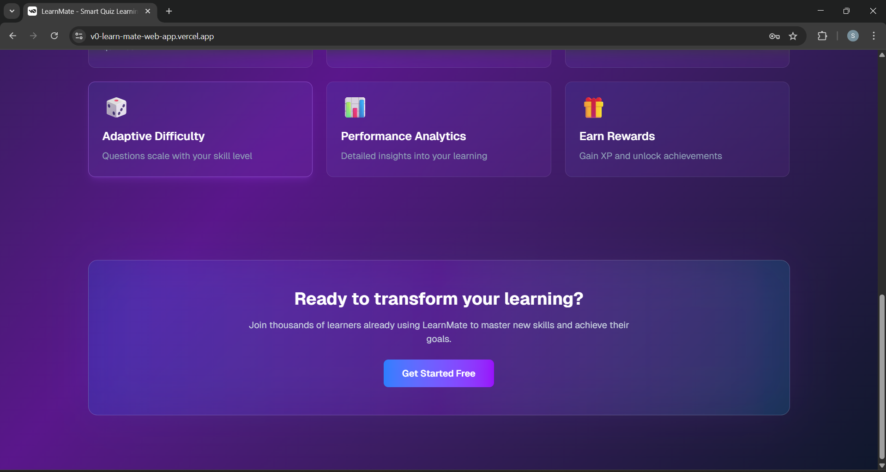
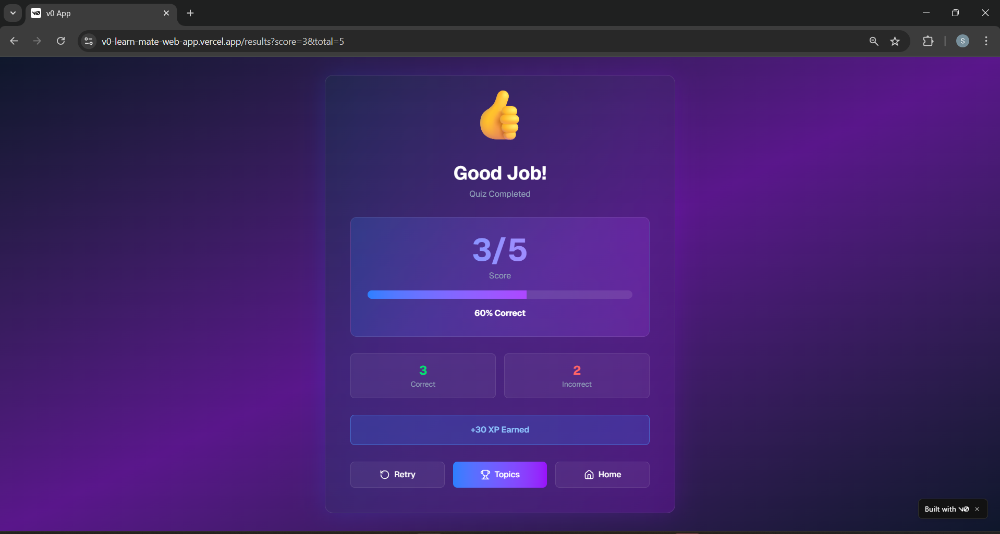

## 📘 Learn-Mate – Smart Learning & Course Companion

✨ ** Learn-Mate ** is an AI-powered smart learning platform designed to help students access courses, track progress, practice quizzes, and learn interactively — all in one modern and beautifully crafted interface.

---

🔗 Live Demo

👉 Website:https://v0-learn-mate-web-app.vercel.app/

👉 GitHub Repository: https://github.com/Sandhiyamrs/learn-mate-web-app.git

---

## 🌈 Features
-📚 Browse courses with detailed modules
-🤖 AI-based doubt solver
-📝 Interactive quizzes & instant feedback
-📊 Progress tracking dashboard
-🎧 Video lessons with notes section
-🌗 Dark & Light mode
-🔐 Login & Register pages
-⚡ Smooth animations & page transitions

---

## 📸 Project Screenshots

### 🏠 Home Page
<p align="center">
  
</p>


### 🎨 Login Page
<p align="center">
  
</p>


### ⚙ Start Page
<p align="center">
  
</p>


### ⚙ Topics Page
<p align="center">
  
</p>


### ⚙ Test Page
<p align="center">
  
</p>


### ⚙ Test-Result Page
<p align="center">
  
</p>


### ⚙ Rewards Page
<p align="center">
  
</p>


---

## 🛠️ Tech Stack
| Frontend | Backend | Dtabase | AI | Hosting |
|-----------|----------|-------------|----------|----------|
| React + Tailwind CSS | Node.js / Express | MongoDB | GPT API / ML Model | Vercel |

---

## 🚀 Live Demo
🍨 **Experience learn-mate-web-app:**  
👉 [Live on Vercel](https://v0-learn-mate-web-app.vercel.app/)

---
👩‍💻 Author : Sandhiya M

🐙 GitHub: https://github.com/Sandhiyamrs

📧 Email: sandhiyamrs2006@gmail.com


---

⭐ Support

If you found this project useful, please ⭐ the repo!


## 💻 How to Run Locally
```bash
git clone https://github.com/<your-username>/ScoopDelight-IceCreamWebsite.git
cd ScoopDelight-IceCreamWebsite
npm install
npm start
